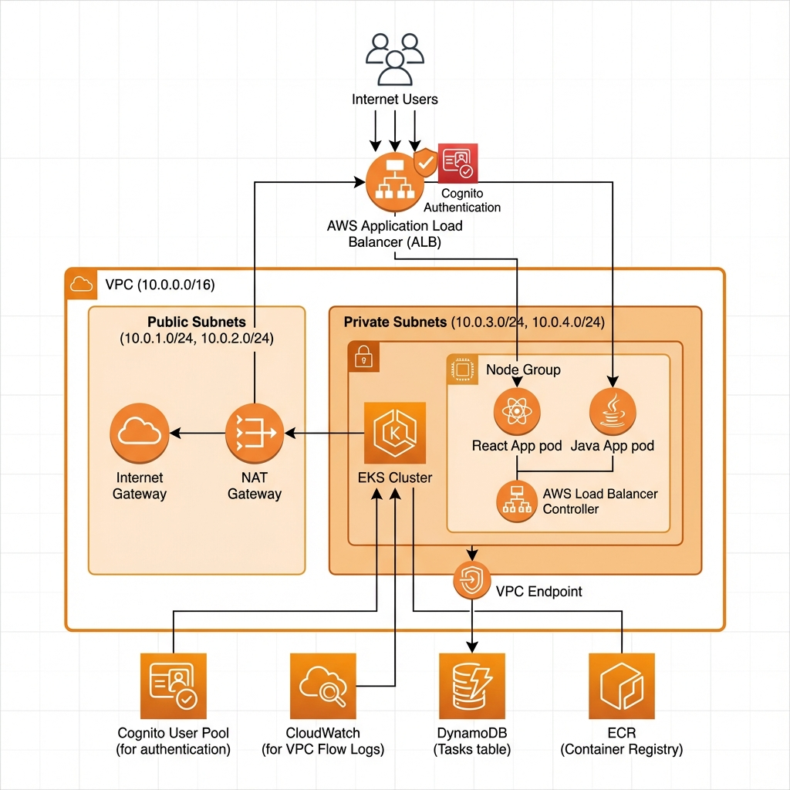

# AWS EKS Terraform Project

Production-ready Terraform configuration for deploying an Amazon EKS (Elastic Kubernetes Service) cluster with microservices, auto-scaling, load balancing, and Cognito authentication.

## Key Features:
### Infrastructure: Implements a Zero Trust architecture with dynamic Horizontal and Vertical Pod Autoscaling (HPA/VPA) driven by the Kubernetes Metrics Server.
### Full-Stack Implementation: Includes a scalable React frontend and Java backend, fully integrated with Amazon Cognito and JWTs for robust authentication and authorization.
### [High-Performance Backend](https://github.com/tartsm1/scalableReacJavaFullStackApp) The backend utilizes Vert.x to deliver asynchronous, non-blocking TCP/UDP performance. By leveraging an event-loop model to serve traffic via lightweight threads, the application minimizes resource consumption and reduces the requirement for multiple ENIs per pod.


## Table of Contents

- [Architecture Overview](#architecture-overview)
- [Project Structure](#project-structure)
- [File Descriptions](#file-descriptions)
- [Prerequisites](#prerequisites)
- [Production Deployment Guide](#production-deployment-guide)
- [Post-Deployment Configuration](#post-deployment-configuration)
- [Microservices](#microservices)
- [Security Features](#security-features)
- [Troubleshooting](#troubleshooting)

---

## Architecture Overview



---

## Project Structure

```
awsKubernetes/
├── main.tf                                 # Root configuration, providers, modules
├── variables.tf                            # Input variables
├── outputs.tf                              # Output values
├── versions.tf                             # Terraform and provider versions
├── iam_alb.tf                              # ALB Controller IAM configuration
├── autoscaler.tf                           # Cluster and Pod autoscaling
├── deployment_javaapp.tf                   # Java backend application
├── deployment_reactapp.tf                  # React frontend + Ingress
├── terraform-deployer-policy.json          # Deployment IAM policy
├── modules/
│   ├── eks/                                # EKS cluster module
│   │   ├── main.tf                         # EKS cluster, node groups, addons
│   │   ├── variables.tf                    # Module variables
│   │   └── outputs.tf                      # Module outputs
│   └── vpc/                                # VPC module
│       ├── main.tf                         # VPC, subnets, NAT, security groups
│       ├── vpc_endpoint.tf                 # DynamoDB VPC endpoint
│       ├── variables.tf                    # Module variables
│       └── outputs.tf                      # Module outputs
```

---

## File Descriptions

### Root Terraform Files

| File | Description |
|------|-------------|
| `main.tf` | Root configuration that sets up AWS, Kubernetes, and Helm providers. Calls VPC and EKS modules and deploys the AWS Load Balancer Controller via Helm. |
| `variables.tf` | Defines all input variables: region, cluster name, VPC CIDR, subnet CIDRs, node sizing, instance types, and container image URLs. |
| `outputs.tf` | Exports cluster endpoint, security group ID, region, cluster name, kubectl configuration command, and ALB DNS name. |
| `versions.tf` | Specifies required Terraform version (≥1.0.0) and provider versions (AWS ≥6.0, Kubernetes ≥3.0, Helm ≥3.0). |
| `iam_alb.tf` | Creates OIDC provider for EKS, IAM role with web identity trust, and comprehensive IAM policy for AWS Load Balancer Controller. |
| `autoscaler.tf` | Deploys Kubernetes Cluster Autoscaler via Helm with IRSA (IAM Roles for Service Accounts). Configures Horizontal Pod Autoscaler for javaapp with CPU/memory scaling. |
| `deployment_javaapp.tf` | Deploys Java backend: Deployment with 2 replicas, security contexts, resource limits, liveness/readiness probes, Service, ServiceAccount, IAM role for DynamoDB access via EKS Pod Identity. |
| `deployment_reactapp.tf` | Deploys React frontend: Deployment with security hardening, Service, ServiceAccount, and main Ingress with path-based routing (`/` → reactapp, `/api` → javaapp) with Cognito authentication. |

### IAM Policy Files

| File | Description |
|------|-------------|
| `terraform-deployer-policy.json` | **Production policy** with least-privilege principles. Restricts resources to specific ARNs, limits to `eu-north-1` region, scopes IAM roles/policies to `my-eks-cluster-*` pattern, and uses PassRole conditions. Use for initial setup and testing. Covers EKS, VPC, IAM, Cognito, ELB, CloudWatch, AutoScaling, ECR, and DynamoDB.|

### Module: `modules/eks/`

| File | Description |
|------|-------------|
| `main.tf` | Creates EKS cluster with private/public endpoint access, managed node group (ARM64, t4g.medium), cluster IAM role, node IAM role with required policies, EKS Pod Identity addon, network policies, and Pod Security Standards labels. |
| `variables.tf` | Module inputs: cluster_name, subnet_ids, node sizing (desired/min/max), instance_types. |
| `outputs.tf` | Exports: cluster_endpoint, cluster_name, cluster_arn, cluster_id, oidc_provider_url, cluster_certificate_authority_data. |

### Module: `modules/vpc/`

| File | Description |
|------|-------------|
| `main.tf` | Creates VPC with DNS support, Internet Gateway, public/private subnets across AZs, NAT Gateway with Elastic IP, route tables, security groups for EKS nodes. |
| `vpc_endpoint.tf` | Creates Gateway VPC Endpoint for DynamoDB with route table associations for cost-effective, private access to DynamoDB. |
| `variables.tf` | Module inputs: vpc_cidr, public_subnets, private_subnets, availability_zones, cluster_name. |
| `outputs.tf` | Exports: vpc_id, private_subnet_ids, public_subnet_ids. |

---

## Prerequisites

### Required Tools

| Tool | Version | Installation |
|------|---------|--------------|
| Terraform | ≥ 1.0.0 | [terraform.io/downloads](https://www.terraform.io/downloads.html) |
| AWS CLI | v2 | [aws.amazon.com/cli](https://aws.amazon.com/cli/) |
| kubectl | Latest | [kubernetes.io/docs/tasks/tools](https://kubernetes.io/docs/tasks/tools/) |
| Git | Latest | [git-scm.com](https://git-scm.com/) |

### AWS Account Requirements

1. **AWS Account** with billing enabled
2. **IAM User** with programmatic access (Access Key ID + Secret Access Key)
3. **Container Images** pushed to ECR repositories:
   - `javaapp` repository
   - `reactapp` repository

---

## Production Deployment Guide

### Step 1: Configure IAM Permissions

Before deploying, your IAM user needs appropriate permissions.

#### Option A: Using AWS Console

1. Go to **IAM → Policies → Create Policy**
2. Select the **JSON** tab
3. Copy contents from `terraform-deployer-policy.json`
4. Name it `TerraformEKSDeployerPolicy`
5. Attach the policy to your deployer user/role

#### Option B: Using AWS CLI

```bash
aws iam create-policy \
  --policy-name TerraformEKSDeployerPolicy \
  --policy-document file://terraform-deployer-policy.json \
  --description "Policy for Terraform to deploy EKS infrastructure"

aws iam attach-user-policy \
  --user-name YOUR_USERNAME \
  --policy-arn arn:aws:iam::YOUR_ACCOUNT_ID:policy/TerraformEKSDeployerPolicy
```

> **Note**: The production policy is scoped to:
> - Region: `eu-north-1`
> - Account: `123456789098`
> - Cluster: `my-eks-cluster`
>
> Update these values in the policy file if your configuration differs.

### Step 2: Configure AWS CLI

```bash
aws configure
```

Enter:
- AWS Access Key ID
- AWS Secret Access Key
- Default region: `eu-north-1`
- Default output format: `json`

Verify configuration:
```bash
aws sts get-caller-identity
```

### Step 3: Prepare Container Images

Ensure your application images are pushed to ECR:

```bash
# Authenticate Docker with ECR
aws ecr get-login-password --region eu-north-1 | docker login --username AWS --password-stdin 123456789098.dkr.ecr.eu-north-1.amazonaws.com

# Create repositories (if not exists)
aws ecr create-repository --repository-name javaapp --region eu-north-1
aws ecr create-repository --repository-name reactapp --region eu-north-1

# Tag and push images
docker tag javaapp:latest 123456789098.dkr.ecr.eu-north-1.amazonaws.com/javaapp:123
docker push 123456789098.dkr.ecr.eu-north-1.amazonaws.com/javaapp:123

docker tag reactapp:latest 123456789098.dkr.ecr.eu-north-1.amazonaws.com/reactapp:123
docker push 123456789098.dkr.ecr.eu-north-1.amazonaws.com/reactapp:123
```

### Step 4: Review and Customize Variables

Edit `variables.tf` or create `terraform.tfvars`:

```hcl
# terraform.tfvars
region             = "eu-north-1"
cluster_name       = "my-eks-cluster"
vpc_cidr           = "10.0.0.0/16"
public_subnets     = ["10.0.1.0/24", "10.0.2.0/24"]
private_subnets    = ["10.0.3.0/24", "10.0.4.0/24"]
availability_zones = ["eu-north-1a", "eu-north-1b"]

# Node Group Configuration
desired_size   = 2
min_size       = 1
max_size       = 3
instance_types = ["t4g.medium"]

# Container Images
javaapp_image  = "123456789098.dkr.ecr.eu-north-1.amazonaws.com/javaapp:123"
reactapp_image = "123456789098.dkr.ecr.eu-north-1.amazonaws.com/reactapp:123"
```

### Step 5: Initialize Terraform

```bash
terraform init
```

Expected output:
```
Initializing modules...
Initializing provider plugins...
Terraform has been successfully initialized!
```

### Step 6: Validate Configuration

```bash
terraform validate
```

### Step 7: Plan Deployment

```bash
terraform plan -out=tfplan
```

Review the plan carefully. For a fresh deployment, expect ~60-70 resources to be created.

### Step 8: Apply Configuration

```bash
terraform apply tfplan
```

> **⏱️ Deployment Time**: ~20-25 minutes (EKS cluster creation takes ~10 minutes)

### Step 9: Configure kubectl

After successful deployment:

```bash
aws eks --region eu-north-1 update-kubeconfig --name my-eks-cluster
```

Verify connectivity:
```bash
kubectl get nodes
kubectl get pods --all-namespaces
```

---

## Post-Deployment Configuration

After the deployment is complete, refresh the Terraform state to output the ALB DNS name:
```bash
terraform refresh
```

### Create Cognito Users

```bash
aws cognito-idp admin-create-user \
  --user-pool-id YOUR_USER_POOL_ID \
  --username user@example.com \
  --user-attributes Name=email,Value=user@example.com \
  --temporary-password "TempPass123!"
```

### Verify Deployments

```bash
# Check all pods
kubectl get pods -A -n development

# Check services
kubectl get svc -n development

# Check ingress and ALB
kubectl get ingress -n development

# Check HPA status
kubectl get hpa -n development
```

---

## Microservices

### Java Application (Backend API)
- **Namespace**: `development`
- **Port**: `8888`
- **Path**: `/api/*`
- **Features**:
  - DynamoDB access via EKS Pod Identity
  - Liveness/readiness probes at `/api/test`
  - CPU: 250m-500m, Memory: 256Mi-512Mi
  - Horizontal Pod Autoscaler (2-3 replicas)

### React Application (Frontend)
- **Namespace**: `development`
- **Port**: `80`
- **Path**: `/`
- **Features**:
  - Static file serving via nginx
  - Security-hardened container

---

## Security Features

| Feature | Description |
|---------|-------------|
| **Private Subnets** | EKS nodes run in private subnets, no direct internet access |
| **NAT Gateway** | Outbound internet access for private subnets |
| **Pod Security Standards** | `restricted` profile enforced on development namespace |
| **Security Contexts** | Non-root users, read-only filesystems, dropped capabilities |
| **Network Policies** | Ingress/egress rules for javaapp |
| **Cognito Authentication** | Implemented in React app |
| **IRSA** | IAM Roles for Service Accounts (no static credentials) |
| **EKS Pod Identity** | AWS-native pod identity for DynamoDB access |
| **VPC Endpoints** | Private DynamoDB access without internet |

---

## Troubleshooting

### Common Issues

#### IAM Permission Denied
```
Error: creating IAM Policy: AccessDenied
```
**Solution**: Ensure `terraform-deployer-policy.json` is attached to your IAM user.

#### EKS Cluster Access Denied
```
error: You must be logged in to the server (Unauthorized)
```
**Solution**: 
```bash
aws eks update-kubeconfig --region eu-north-1 --name my-eks-cluster
```

#### ALB Not Provisioning
```bash
kubectl logs -n kube-system deployment/aws-load-balancer-controller
```
Check for IAM permission issues or subnet tagging problems.

#### Pods Stuck in Pending
```bash
kubectl describe pod POD_NAME
```
Check for resource constraints or node group scaling issues.

#### Tail logs
```bash
kubectl logs -f -n development -l app=javaapp
```

#### HPA status
```bash
kubectl describe hpa -n development javaapp-hpa | tail -20
```

#### Metrics server
```bash
kubectl get pods -n kube-system -l k8s-app=metrics-server
```

### Useful Terraform Commands

```bash
# View Terraform state
terraform state list

# Import existing resource
terraform import aws_eks_cluster.main my-eks-cluster

# Destroy all resources
terraform destroy

# Format Terraform files
terraform fmt -recursive
```

---

## Clean Up

To destroy all resources:

```bash
terraform destroy
```

> **⚠️ Warning**: This will delete all resources including the EKS cluster, VPC, and all data. This action is irreversible.

---

## Cost Estimation

| Resource | Estimated Monthly Cost |
|----------|----------------------|
| EKS Cluster | ~$73 |
| NAT Gateway | ~$32 + data transfer |
| EC2 (2x t4g.medium) | ~$54 |
| ALB | ~$16 + LCU charges |
| CloudWatch Logs | ~$0.50/GB |
| **Total (estimated)** | **~$175-200/month** |

---

## How improve you setup

Recommendations do improve your setup [./recommendations.md](./recommendations.md)

--- 

## Contacts

My Slack: [friendly-solutions](https://join.slack.com/t/friendlysolutionsco/shared_invite/zt-3gqtsiax0-m7uCPEfzprlPWYntp4lcXg) 

--- 

## License

MIT License
Free to use unless reference to my homepage https://friendly-solution.com/ not removed ;) 
